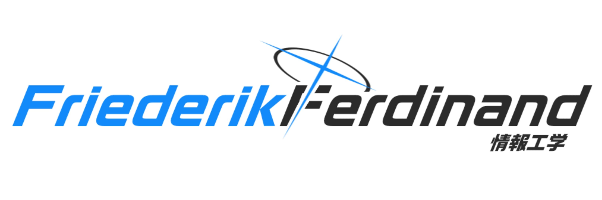

<h1 align="center">Hi 👋, I'm Friederik Ferdinand</h1>

  

## 🚀 About Me
I’m Friederik Ferdinand — a web3 developer passionate about building decentralized applications, writing secure smart contracts, and exploring the new primitives of Web3: tokens, DAOs, on-chain governance, NFTs, and layer-2 scaling.

- 🌐 Focus: **Smart Contracts**, **dApps**, **On-chain Infrastructure**, and **Web3 UX**.
- 🧠 Interests: Ethereum, EVM-compatible chains, Solana, cross-chain tooling, and developer tooling for secure, auditable systems.
- 🎯 Goal: Ship production-ready smart contracts and delightful dApp experiences while prioritizing security and composability.

---

## 🧰 My Web3 Toolbox
Tools, frameworks, and libraries I use daily:

---

## 🔍 Featured Repositories

### 🧩 [web3-dapp-starter](https://github.com/PixelPirate/web3-dapp-starter)
A starter kit for building modern dApps with Next.js, TypeScript, Ethers.js, and Hardhat. Includes:
- Connect wallet (MetaMask / WalletConnect / RainbowKit)
- Example Solidity contracts + Hardhat tests
- Deployment scripts for testnets
- CI-friendly test and lint setup

### 🛡️ [secure-solidity-contracts](https://github.com/PixelPirate/secure-solidity-contracts)
A curated library of audited patterns and helpers: access control, upgradeable proxies, safe math/utilities, and test suites. Uses OpenZeppelin and includes test coverage and fuzzing with Foundry.

### 🎨 [onchain-nft-collection](https://github.com/PixelPirate/onchain-nft-collection)
An on-chain generative NFT collection with metadata stored on IPFS + a small React gallery and minting dApp. Includes a gas-optimized minting contract and front-end hooks.

### 📊 [subgraph-analytics](https://github.com/PixelPirate/subgraph-analytics)
A The Graph subgraph + dashboard for on-chain analytics (token flows, liquidity, holders distribution). Great for building dashboards and insights.

---

## 🧪 How I Work
- **Test-driven**: unit tests, integration tests, and property-based tests (Foundry / Hardhat / Brownie).  
- **Security-first**: OpenZeppelin, fuzzing tools, manual audits before deployment.  
- **Modular & composable**: small contracts, clear interfaces, upgradeable design.

---

## 📈 GitHub Stats

---

## 🕛 WakaTime Stats

---

## 📫 Let's Build Together
- 💼 [LinkedIn](https://linkedin.com/in/friederikferdinand)
- 📧 friederikferdinand@gmail.com

If you want to collaborate, audit a contract, or brainstorm an idea — open an issue or DM me.

---

⭐ *If you like this work, please star and follow for updates. Happy building!*
